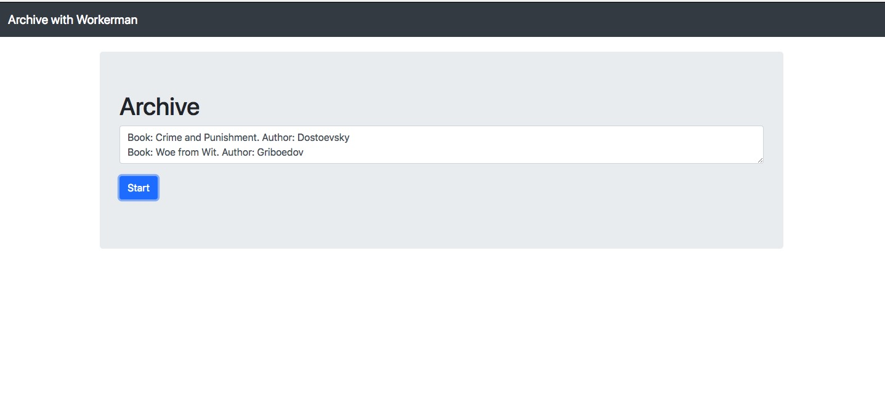

Websockets with Workerman framework
=======
Updates a form info through websockets

Prerequisites
=======
* php 5.6 or higher
* php-cntl

Installing
=======
* git clone the repo
* php server.php start
* open in browser index.html
* click button "Start"

Example
=======

